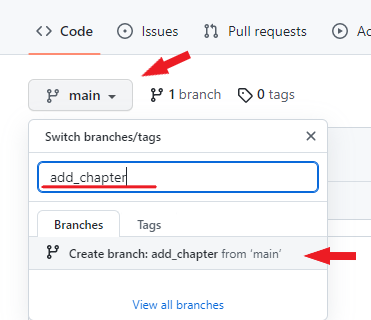
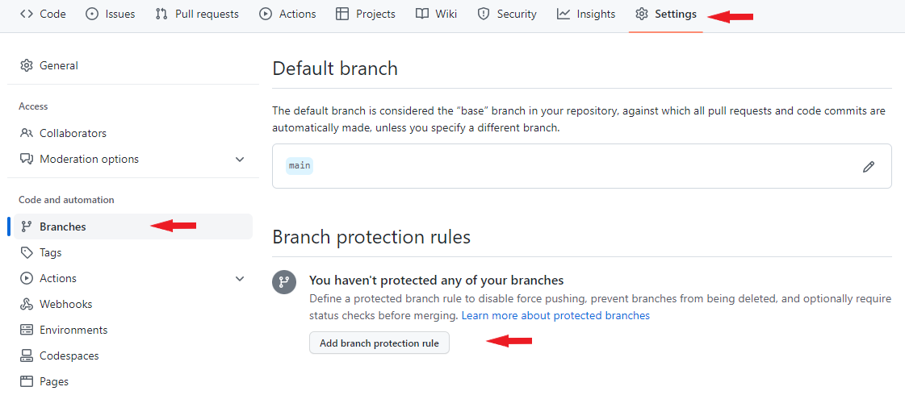

# *Инструкция по использованияю GitHub*

## Что такое GitHub?

[X] Выполнено

*GitHub* – это веб-интерфейс, в котором можно хранить свои репозитории Git, а также эффективно отслеживать и управлять своими изменениями. С его помощью разные разработчики имеют доступ к коду одного проекта. У вас есть возможность вносить свои собственные изменения в проект одновременно с другими разработчиками.

Например, если вы вдруг допустили какую-то ошибку во время внесения изменений, вы можете легко вернуться к предыдущему этапу, где ошибки еще нет.

<table>
    <caption>
        <h2>Для чего нужно использовать GitHub?</h2>
    </caption>
    <tr>
        <td><b>Эффективное управление проектами</b></td>
        <td>GitHub – это своего рода хранилище ваших репозиториев. GitHub позволяет разработчикам работать над одним проектом, находясь в разных местах. 
        С помощью GitHub вы можете легко отслеживать внесенные вами изменения и управлять ими, а также проверять ход вашей работы над проектом.</td>
    </tr>
    <tr>
        <td><b>Простое сотрудничество</b></td>
        <td>С GitHub разработчики со всего мира могут работать вместе на одним проектом без каких-либо проблем.
         
        Команды разработчиков могут оставаться на одной странице во время совместной работы над проектом и могут легко организовывать и эффективно управлять проектом.</td>
    </tr>
    <tr>
        <td><b>Открытый исходный код</b></td>
        <td>GitHub – это бесплатная система с открытым исходным кодом. Это означает, что разработчики могут легко получить доступ к различным типам кода/проектов, которые они могут использовать для обучения и развития своих навыков.</td>
    </tr>
    <tr>
        <td><b>Универсальность</b></td>
        <td>Это свойство GitHub очень важно. GitHub – это веб-интерфейс не только для разработчиков. Его также могут использовать дизайнеры, писатели и все, кто хочет отслеживать историю своих проектов.</td>
    </tr>
</table>

## GitHub плюсы

1. Бесплатное обслуживание, хотя есть и платные.
2. Очень быстрый поиск в структуре репозиториев.
3. Большое сообщество и легко найти помощь.
4. Он предлагает практические инструменты для сотрудничества и хорошую интеграцию с Git.
5. Легко интегрируется с другими сторонними сервисами.
6. Он также работает с TFS, HG и SVN.

## GitHub минусы

 У него есть ограничения по пространству, так как вы не можете превышать 100 МБ в одном файле, в то время как репозитории ограничены 1 ГБ в бесплатной версии.

* У него есть ограничения по пространству, так как вы не можете превышать 100 МБ в одном файле, в то время как репозитории ограничены 1 ГБ в бесплатной версии.
## Преимущества и недостатки GitLab

### Преимущество

* Бесплатный план без ограничений, но есть планы оплаты.
* Это лицензия с открытым исходным кодом.
* Разрешает самостоятельный хостинг на любом плане.
* Он очень хорошо интегрирован с Git.

### Недостатки

* Его интерфейс может быть несколько медленнее по сравнению с конкурентами.
* Есть несколько общих проблем с репозиториями.

## Чтобы скопировать репозиторий с GitHub:

---
1. Нужно взять ссылку в GitHub, нажав на кнопку code.
2. Зайти в терминал на своем компьютере.
3. Командой git clone ссылка на репозиторий из GitHub *"git clone ссылка на репозиторий из GitHub"* мы переносим репозиторий из GitGub.

## Чтобы перенести свой репозиторий на GitHub:  
---
1. Чтобы залить свой репозиторий, необходимо иметь свой аккаунт на GitHub.
2. Далее на сайте в правом верхнем углу нажать плюсик, выбрать "new repository", дать ему имя и нажать кнопку «создать».
3. Далее мы идем в наш терминал и вводим следующую команду: __git remote add origin *<ссылка на репозиторий>*__
4. Далее __git branch -M main__ - указываем, что основная ветка main
5. Далее __git push -u origin main__ - отправляем репозиторий (иногда просит просто git push)

  
## Чтобы поучаствовать в чьем-то проекте на GitHub:  
---
Мы можем справа вверху в GitHub в нужном репозитории нажать Fork.

И тогда дубликат исходного репозитория копируется к нам в аккаунт и с ним мы можем работать. Мы ответвлились. Мы можем работать на нем, скопируя на свой терминал командой __git clone__ (смотри инструкцию выше) и дальше работать на нем, не забывая "пушить", перенося наши коммиты в наше ответвление в репозитории на GitHub.

Работаем мы только в своей ветке, ее нужно создать как только мы залили к себе чужой репозиторий и хотим начать работать с ним!

Чтобы запросить слияние с основной веткой в проекте, нам необходим __pull request__.

### Что для этого нужно:
Как только мы сделали все необходимые изменения, закомитили их, перенесли (запушили) их в GitHub, проверили что все точно так, как нам нужно, то в GitHub сверху нажимаем кнопку "Pull request" , далее "Compare and request" пишем наш комментарий и отправляем создателю репозитория.
# GitHub_instruction

## Создание локального репозитория на основе данных из удаленного репозитория 

1. Создать локальный репозиторий, если нет.
2. Находим искомый удалённый репозитории копируем ссылку. 
3. В Visual Studio Code вводим команду [git clone <*link*>] для скачивания данных, которые хранятся удаленно.
4. Для смены директории вводим [cd <*название директории*>]
После введенных изменений, производим операции по сохранению (commit).
5. Для переноса данных на удаленный репозиторий (на GitHub), вводм команду [git push],  при этом, возможно, 
вам нужно будет авторизоваться на удалённом репозитории.

6. При этом если были произведены изменения “с другого компьютера”, можно выкачать [git pull] актуальное состояние из удалённого репозитория.

## Создание нового репозитория

1. В GitHub выбираем опцию <*Сreate new repository*>.

2. Заполняем форму (имя только на англиском).

3. Находим данный репозиторй в своем аккаунте.

## Как клонировать Git-репозиторий

Чтобы начать работать, нам нужно «клонировать» репозиторий. Клонирование означает скачивание из источника всего кода проекта, а также метаданных. Источником в нашем случае является GitHub.
Для *КЛОНИРОВАНИЯ РЕПОЗИТОРИЯ* на компьютер необходимо:

* перейти в репозиторий на **[GitHub](https://github.com/)** и нажмать большую зеленую кнопку под названием **Clone or download**;

* нажать на иконку буфера обмена для копирования-вставки (либо выделить ссылку и скопировать ее);

* открыть **терминал**;

* ввести команду **git clone <то_что_вы_только_что_скопировали>**

*Не забудьте изменить информацию в угловых скобках на нужную вам. И удалите сами скобки < >.*

    $ git clone git@github.com:johnmosesman/practical-git-tutorial.git
    Cloning into 'practical-git-tutorial'...
    remote: Enumerating objects: 6, done.
    remote: Counting objects: 100% (6/6), done.
    remote: Compressing objects: 100% (3/3), done.
    remote: Total 6 (delta 0), reused 0 (delta 0), pack-reused 0
    Receiving objects: 100% (6/6), done.
    Давайте перейдем в папку проекта (при помощи команды cd):

    $ cd practical-git-tutorial/
    /practical-git-tutorial (main)$
    ## Ветки в Git

Наличие (main) рядом с именем папки означает, что в настоящее время мы находимся в ветке под названием main. Что такое ветка (англ branch)? Считайте, что это копия проекта в определенный момент времени, которую можно изменять независимо от других веток.

Рассмотрим пример. Если бы мы писали книгу, у нас могли бы быть следующие ветки:

* main branch (главная ветка)
* table-of-contents branch (ветка содержания)
* chapter-1 branch (ветка первой главы)
* chapter-2 branch (ветка второй главы)
* и так далее.

Ветка main — главная. Это место, где мы будем собирать все содержимое воедино, в законченную книгу.

Создавая дополнительные ветки, мы можем разделять нашу работу на сколь угодно много частей, а затем отслеживать их по отдельности.

Допустим, я работаю над Главой 1, а вы — над Главой 2. Мы можем создать две разные ветки, chapter-1 и chapter-2, каждая из которых будет отдельной копией текущего состояния книги.

Это даст нам возможность работать над своими главами по отдельности, не наступая друг другу на ноги и без риска случайно перезаписать написанное коллегой. У каждого будет своя рабочая копия.

Когда один из нас закончит работу над своей главой, он сможет добавить содержимое этой главы обратно в ветку main. Когда мы оба закончим работу, в ветке main будет и Глава 1, и Глава 2.

Несмотря на все, что я сказал, временами коллеги все же перезаписывают изменения, внесенные товарищами по команде, или меняют один и тот же кусок кода, и тогда им приходится утрясать различия. Но об этом позже.

Примечание. Главная ветка может называться не main, а master: это зависит от проекта. Функциональной разницы нет.

## Создание веток через GitHub

Как и в случае создания репозитория, можно быстро создавать новую ветвь в GitHub и переключаться между существующими ветками.

По умолчанию при загрузке нового проекта на GitHub в хранилище создаётся ветвь с именем *main* — это основная ветка. Дополнительные ветви используют для одновременного создания различных версий проекта. Это удобно, чтобы добавлять новые возможности, не изменяя основной исходный код. Можно использовать ветви для экспериментов и внесения правок до внесения изменений в основной код. Например, когда идёт работа над новыми фичами.

Когда создаётся ответвление от основной ветви проекта в GitHub, создаётся копия основной ветви в том виде, в котором она была в этот момент. Если кто-то другой вносил изменения в основную ветку, пока владелец ветки работал над своей, он сможет использовать обновления. Этого не происходит автоматически. Человек должен сам обновить свою ветку, если захочет.

Для создания ветви перейдите на вкладку **Code** в созданном репозитории и щёлкните на выпадающем списке веток и тегов в верхней части списка с надписью *main*. В текстовом поле введите название ветви, например *add_chapter*, после чего нажмите **Create branch** — *add_chapter* отразится в основной ветви.

Теперь появились две ветви — основная и *add_chapter*, которые выглядят одинаково. Добавлять изменения можно в новую ветку.

## Создание *pull request*

* делаем *fork* нужного репозитория
* делаем *git clone* своей версии репозитория
* создаем новую ветку и в нее вносим свои изменения
* фиксируем изменения (делаем коммиты)
* отправляем свою версию в свой GithHub 
* на сайте GitHub нажимаем кнопку *pull request*

## Синхронизация с удалённым репозиторием
1. Мы делаем (fork) интересующего нас репозитория
2. Мы делаем (git clone) для нашей версии этого репозитория
3. мы создаем ветку с предлагаемыми изменениями
4. Производим изменения только в этой ветке
5. Далее отправляем эти изменения на свой аккаунт (push)
6. В окне на гитхаб появл взможность отправить pull request.
***

# Инструкция по пользованию GitHub

## Совместная работа в проекте. Создание запросов слияния.

1. Делаем **форк (fork)** интересующего нас репозитория.
2. Делаем **git clone для нашей** версии этого репозитория.
3. Создаем ветку с предлагаемыми изменениями.
4. Производим все изменения **только в этой ветке**.
5. Фиксируем изменения **(делаем коммиты)**.
6. Отправляем эти изменения на **свой аккаунт (push)**.
7. В окне на Github появляется возможность отправить **pull request**.
***
## Pull Request со стороны владельца программы.

При подключении к работе сторонних специалистов может понадобиться функция запроса слияния (Pull Request). 

1. Открыть вкладку **Pull Request**.
2. Нажать на кнопку **Create Pull Request**.
3. Выбрать ветку, которую следует слить с основной.
4. Просмотреть внесенные кодером изменения.
5. После изучения информации созданный запрос на слияние подтверждается нажатием **Merge Pull Request**.

Новый код будет импортирован в основную ветку, а созданная сторонним исполнителем может спокойно удаляться.

Также на шаге 5 владелец программы может не только окончательно принять пул-реквест, подтвердив слияние (merge) веток, но и отклонить, закрыв запрос **Close pull request**.

## Защита ветки main репозитория

Главную ветку *main* можно защитить от изменений, включив соответствующие опции в настройках репозитория (что вам и будет предложено при создании новых веток).

Чтобы поменять данный ряд параметров, зайдите в своём репозитории в раздел **Settings -> Branches**. Нужные настройки — в подразделе **Branch protection rules** (целых 10 галочек на выбор).

## Отчеты об ошибках.

На вкладке *Issue* любой «тестировщик» может оставить сообщение о проблемах, с которыми ему пришлось столкнуться при использовании ПО.
1. Нажать кнопку **New issue**.
2. Внести заголовок и текст сообщения.

В результате, владелец ветки получает уведомления в личном кабинете или на электронную почту, указанную при регистрации.

## Еще немного полезностей в копилочку

* **pwd** - print working directory
показыввает _path_ - где находимся.
* **dir** - позволяет посмотреть, что в папке.
* **cd** - change directory позволяет сменить директорию.

## Долгожданный Release

Финалом разработки обычно становится выпуск определенного релиза программного продукта.
Это отражается на вкладке «Releases». 

1. Нажать на кнопку **Create New Release**.
2. Указать номер версии в поле **Tag Version**.
3. Внести название и небольшое описание. 
4. Прикрепить здесь архивы с компилированными файлами.
5. Нажать на **Create Release** и убедиться в публикации релиза. 

Ссылки на исходный код в tar.gz и zip создаются автоматически. 

Остальные файлы понадобится добавлять вручную.
Вуаля

## Операции с файлами
- - -

Перемещение и удаление версий файлов репозитория

1. Чтобы удалить конкретный файл из рабочей директории и индексировать его удаление необходимо ввести "*git rm [файл]*"

2. Чтобы убрать конкретный файл из контроля версий, но физически оставить его на своём месте необходимо ввести команду "*git rm*" --cached [файл]

3. Чтобы перенести и переименовать указанный файл, сразу индексируя его для последующего коммита необходимо ввести команду "*git mv*" [оригинальный файл] [новое имя]

## Заключение
_________________

*GitHub* предлагает множество инструментов для работы с кодом и позволяет сделать ее проще.Теперь вы полноценный пользователь *GitHub*. Вы знаете как создать аккаунт, управлять организацией, создавать и обновлять репозитории, помогать другим проектам и принимать чужой вклад в свой проект. Вы можете объединяться со специалистами из разных стран и совместно работать над проектом, помогая друг другу с исправлением ошибок и ускоряя процесс разработки параллельно решая одну задачу.
